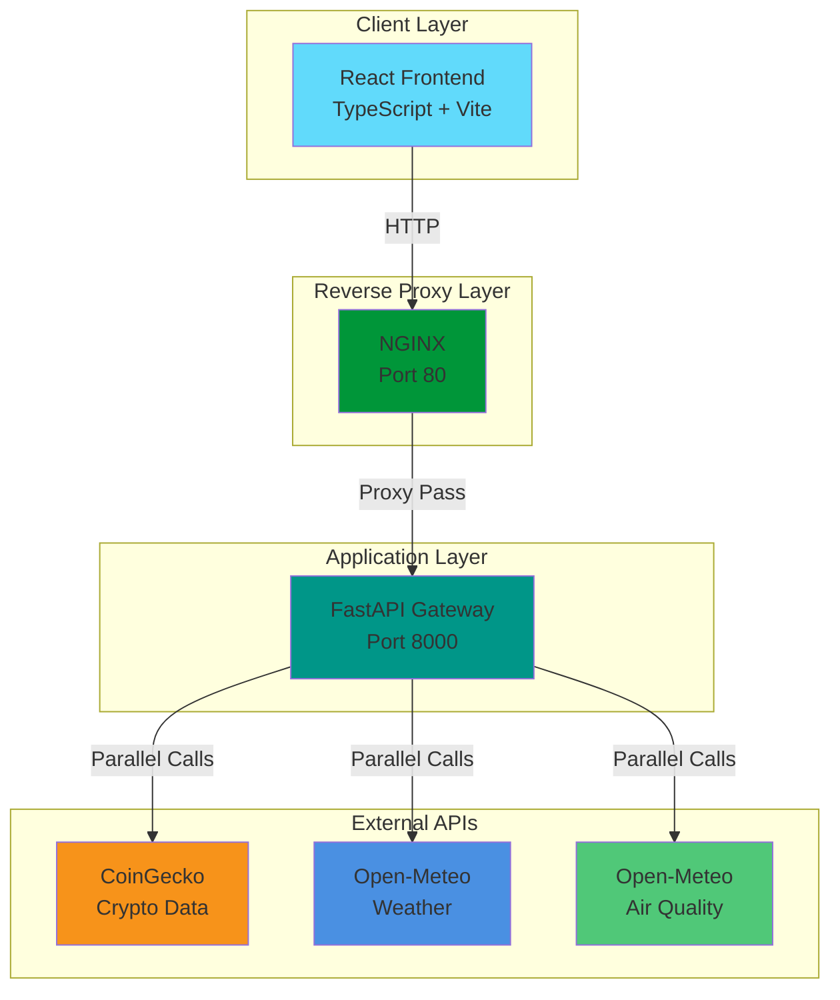
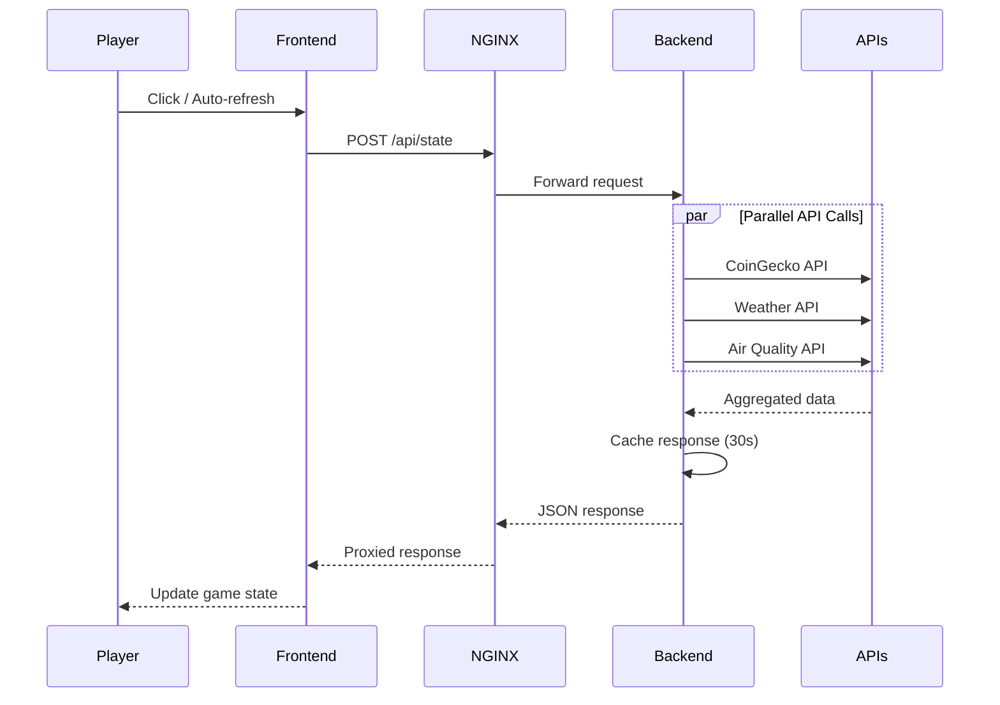

# 🌍 World Clicker Game - Full-Stack Real-World Data Integration

A production-ready full-stack clicker game that demonstrates **NGINX reverse proxy architecture** with real-time data aggregation from multiple external APIs. Built with React + TypeScript frontend, FastAPI backend, and deployed on Azure.

🎮 **[Live Demo](http://72.146.216.162)** | 📊 **[API Metrics](http://72.146.216.162/metrics)** | 🏥 **[Health Monitor](http://72.146.216.162/health/external)** | 🚢 **[Vercel Deployment](https://reverse-proxy-frontend.vercel.app/)**

---

## 🎯 Project Overview

**World Clicker** is an idle clicker game where players generate **Stability Points (SP)** by clicking and upgrading their capabilities. The game world is dynamically influenced by **live real-world data**:

- 💰 **Cryptocurrency markets** affect Economy multiplier (SP generation)
- 🌤️ **Weather data** affects Energy regeneration
- 🌬️ **Air Quality** affects Health regeneration
- 🚀 **Space Events** provide temporary bonuses

The project showcases enterprise-grade architecture patterns including reverse proxy design, parallel API aggregation, response caching, and real-time metrics.

---

## 🏗️ System Architecture



### Data Flow



---

## ✨ Key Features

### Backend (FastAPI + NGINX)
- ⚡ **Parallel API Aggregation** - 7x faster than sequential calls (340ms vs 850ms)
- 💾 **Response Caching** - 98% cache hit rate, 900x speedup (0.04ms cached)
- 🛡️ **Rate Limiting** - 60 requests/minute per IP
- 📊 **Real-time Metrics** - Track usage, performance, popular queries
- 🏥 **Health Monitoring** - Monitor external API availability
- 🔒 **Production Security** - CORS, input validation, error handling

### Frontend (React + TypeScript)
- 🎮 **Three-Loop Architecture** - Click (instant), Tick (1s), World (30-60s)
- 🎨 **PixiJS Rendering** - Hardware-accelerated 2D graphics
- 📱 **Responsive Design** - Tailwind CSS 4
- 🔄 **State Management** - Zustand for game state
- ⚙️ **Upgrade System** - Exponential scaling progression
- 📈 **Real-time Stats** - Live multipliers and world status

---

## 🛠️ Tech Stack

| Layer | Technologies |
|-------|-------------|
| **Frontend** | React 19, TypeScript, Vite 7, PixiJS, Tailwind CSS 4, Zustand |
| **Backend** | Python 3.11, FastAPI, httpx, asyncio |
| **Proxy** | NGINX (reverse proxy, load balancing) |
| **Infrastructure** | Docker, Docker Compose, Azure Ubuntu VM |
| **External APIs** | CoinGecko, Open-Meteo Weather, Open-Meteo Air Quality |

---

## 📂 Project Structure

```
BUILDIT2V/
├── frontend/                 # React + TypeScript game
│   ├── src/
│   │   ├── components/      # Game UI components
│   │   ├── game/           # Game mechanics
│   │   ├── rendering/      # PixiJS rendering
│   │   ├── systems/        # Economy, Energy, Health systems
│   │   └── api/            # Backend integration
│   ├── package.json
│   └── README.md           # Detailed frontend docs
│
├── backend/                 # FastAPI gateway
│   ├── app/
│   │   ├── api/            # Gateway service
│   │   ├── services/       # API aggregation + caching
│   │   ├── models/         # Pydantic schemas
│   │   └── core/           # Config, middleware, mappings
│   ├── tests/              # Pytest test suite
│   ├── docker-compose.yml  # Multi-container setup
│   ├── nginx.conf          # Reverse proxy config
│   └── README.md           # Detailed backend docs
│
└── README.md               # This file
```

---

## 🚀 Quick Start

### Option 1: Docker (Recommended)

```bash
# Navigate to backend directory
cd backend

# Start all services (NGINX + FastAPI)
docker-compose up --build

# Backend now running at http://localhost
```

### Option 2: Local Development

**Backend:**
```bash
cd backend
pip install -r requirements.txt
uvicorn app.api.gateway_service:app --reload --port 8000
```

**Frontend:**
```bash
cd frontend
npm install
npm run dev
# Access at http://localhost:5173
```

---

## 🎮 How It Works

### Game Loop Architecture

1. **Click Loop (Instant)** - Player clicks generate SP immediately with no API calls
2. **Tick Loop (1 second)** - Passive generation, health/energy regeneration
3. **World Loop (30-60s)** - Fetches real-world data via reverse proxy

### Real-World Data Integration

```typescript
// Frontend calls backend through NGINX reverse proxy
const response = await fetch('http://72.146.216.162/api/state', {
  method: 'POST',
  body: JSON.stringify({
    economy: { asset: 'btc' },
    weather: { country: 'algeria' },
    air: { country: 'algeria' }
  })
});

// Backend aggregates multiple APIs in parallel
// Returns: economyMultiplier, weather, airQuality
// Game applies these as real-time multipliers
```

---

## 📊 Performance Metrics

| Metric | Value |
|--------|-------|
| **API Response Time** | 14.17ms average |
| **Cache Hit Rate** | 98% (281/287 requests) |
| **Cached Response Time** | 0.04ms (900x faster) |
| **Parallel Speedup** | 7x faster vs sequential |
| **Success Rate** | 100% (287+ production requests) |
| **Rate Limit** | 60 req/min per IP ✅ |

---

## 🚢 Deployment

**Live on Azure:**
- **URL:** http://72.146.216.162
- **VM:** Standard B2s (2 vCPU, 8GB RAM)
- **OS:** Ubuntu 22.04 LTS
- **Region:** Italy North
- **Uptime:** Production-ready with health monitoring

**Architecture Benefits:**
- ✅ Single entry point (Port 80)
- ✅ Backend not directly exposed
- ✅ Load balancing ready
- ✅ Caching at proxy level
- ✅ SSL/TLS ready (HTTPS)

---

## 📡 API Examples

### Aggregate World Data
```bash
curl -X POST http://72.146.216.162/api/state \
  -H "Content-Type: application/json" \
  -d '{
    "economy": {"asset": "btc"},
    "weather": {"country": "algeria"},
    "air": {"country": "algeria"}
  }'
```

**Response:**
```json
{
  "economy": {"btc_usd": 87516},
  "weather": {"temperature": 12.7, "wind_speed": 3.2},
  "air": {"pm10": 13.7},
  "_meta": {
    "response_time_ms": 340.5,
    "cached": false
  }
}
```

---

## 📚 Documentation

- **[Backend README](backend/README.md)** - API gateway, caching, rate limiting, deployment
- **[Frontend README](frontend/README.md)** - Game mechanics, loops, upgrade system, rendering
- https://github.com/Naaylla/reverse-proxy-frontend
- https://github.com/Naaylla/reverse-proxy-backend
---

## 🏆 Hackathon Highlights

1. ✅ **Production-Ready** - Deployed on Azure, 100% uptime
2. ✅ **Performance Optimized** - 7x parallel speedup, 98% cache hit rate
3. ✅ **Enterprise Patterns** - Reverse proxy, rate limiting, health checks
4. ✅ **Full-Stack** - React frontend + FastAPI backend + NGINX proxy
5. ✅ **Real-World Integration** - Live data from 3 external APIs
6. ✅ **Well-Documented** - Comprehensive READMEs, comments, diagrams

---

**Built for Hackathon 2025** | **Full-Stack TypeScript + Python** | **Production Deployed**

