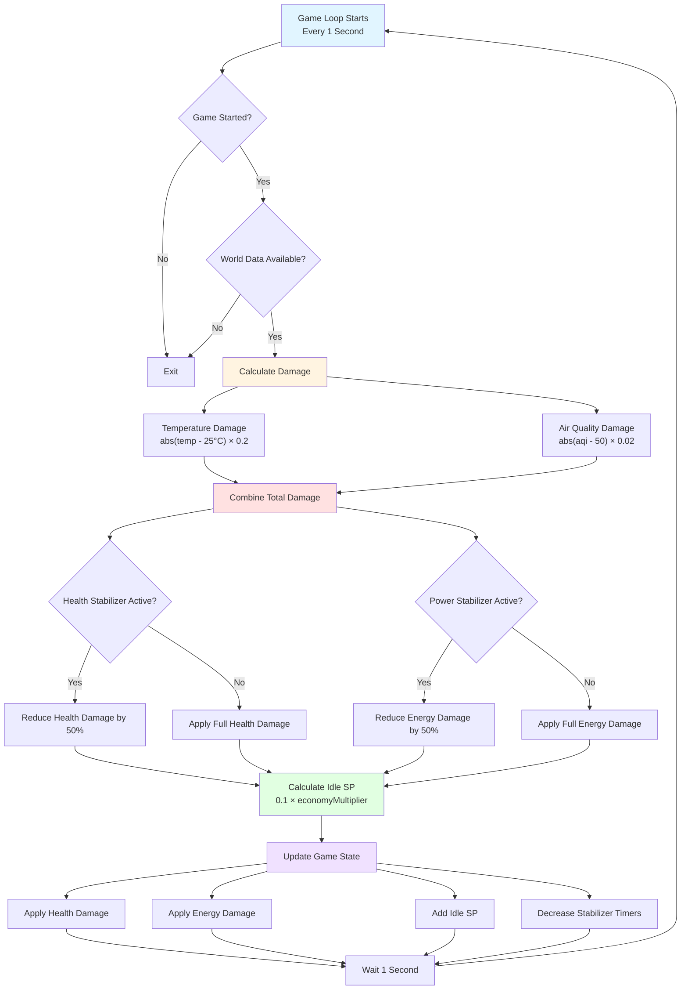

# 🌍 World Clicker Game

A real-world data-driven clicker game that demonstrates **NGINX reverse proxy** architecture. The game integrates live data from multiple public APIs (crypto markets, weather, air quality, space events) to create an engaging idle clicker experience.

---

## 🎮 Game Concept

**World Clicker Game** is an idle clicker where players generate **Stability Points (SP)** by clicking and upgrading their capabilities. The game world is dynamically influenced by real-world data:

- **Weather** affects Energy regeneration
- **Cryptocurrency markets** affect Economy multiplier (SP generation)
- **Air Quality** affects Health regeneration
- **Space Events** provide temporary bonuses

The core gameplay loop combines player actions (clicking) with passive generation and world events to create a dynamic, engaging experience.

---

## 🔄 Game Loop Architecture

The game operates on **three coordinated loops** that work together seamlessly:

### Game Loop Flow (Every 1 Second)



### 1️⃣ Click Loop (Instant Response)
- **Trigger:** Player clicks the main button
- **Frequency:** On-demand (instant)
- **Actions:**
  - Adds Stability Points based on `clickPower`
  - Applies current multipliers (economy, space events)
  - Updates click statistics
- **No API calls** - Always responsive, never blocked

**Formula:**
```
SP Gained = clickPower × economyMultiplier × cryptoMultiplier × spaceEventBonus
```

### 2️⃣ Tick Loop (Every 1 Second)
- **Trigger:** Automatic timer (1 second intervals)
- **Frequency:** Continuous
- **Actions:**
  - Adds idle generation SP
  - Applies passive health regeneration (affected by air quality)
  - Applies passive energy regeneration (affected by weather)
  - Updates economy multiplier from latest world data
- **No API calls** - Pure client-side logic

**Health Formula:**
```
New Health = Current Health - 0.05 + (airQualityMultiplier × 0.1)
Health is clamped between 0-100%
```

**Energy Formula:**
```
New Energy = Current Energy - 0.1 + (weatherMultiplier × 0.15)
Energy is clamped between 0-100%
```

**Idle SP Generation:**
```
SP/second = idleGeneration × cryptoMultiplier
```

### 3️⃣ World Loop (Every 30-60 Seconds)
- **Trigger:** Automatic timer (randomized 30-60 seconds)
- **Frequency:** Periodic
- **Actions:**
  - Fetches world data from backend API (via NGINX reverse proxy)
  - Updates global game modifiers
  - Refreshes world status display
- **API calls** - Goes through reverse proxy to backend

**API Endpoints Used:**
- `/api/world-data` - Aggregated world state from backend

---

## 📊 Resources & Stats

### Primary Resources

| Resource | Description | Max Value | Affected By |
|----------|-------------|-----------|-------------|
| **Stability Points (SP)** | Main currency | ∞ | Clicking, idle generation, upgrades |
| **Health** | Player vitality | 100% | Air quality multiplier |
| **Energy** | Player stamina | 100% | Weather multiplier |
| **Economy Multiplier** | SP generation boost | Variable | Crypto market changes |

### World Data Components

#### 🌤️ Weather Data
- **Source:** Weather API (Open-Meteo or similar)
- **Fields:** Temperature, Condition, Humidity
- **Effect:** `energyMultiplier` (affects energy regeneration)
- **Range:** 0.8x - 1.5x multiplier
- **Optimal:** 20-25°C = 1.5x multiplier

#### ₿ Cryptocurrency Data
- **Source:** CoinGecko API
- **Fields:** Bitcoin price, Ethereum price, 24h change
- **Effect:** `economyMultiplier` (affects all SP generation)
- **Range:** 0.5x - 2.0x multiplier
- **Calculation:** Based on 24h price change percentage

#### 🌬️ Air Quality Data
- **Source:** Air Quality API (OpenAQ or similar)
- **Fields:** AQI (Air Quality Index), Level
- **Effect:** `healthMultiplier` (affects health regeneration)
- **Range:** 0.6x - 1.2x multiplier
- **Optimal:** AQI ≤ 50 = 1.2x multiplier (Good air quality)

#### 🚀 Space Events
- **Source:** NASA API or Random Events
- **Fields:** Event name, Bonus multiplier, Description
- **Effect:** Temporary bonus to all SP generation
- **Range:** 1.0x - 1.5x bonus multiplier
- **Types:** Solar Flares, Meteor Showers, Aurora, Space Station Passes

---

## ⚙️ Upgrade System

### Click Power Upgrade
- **Cost Formula:** `clickPower × 10 × 1.5^(level - 1)`
- **Effect:** Increases SP gained per click
- **Example Costs:**
  - Level 1 → 2: 10 SP
  - Level 2 → 3: 15 SP
  - Level 3 → 4: 22 SP
  - Level 10 → 11: 576 SP

### Idle Generation Upgrade
- **Cost Formula:** `(level + 1) × 20 × 1.5^level`
- **Effect:** Increases passive SP generation per second
- **Example Costs:**
  - Level 0 → 1: 20 SP
  - Level 1 → 2: 60 SP
  - Level 2 → 3: 180 SP
  - Level 10 → 11: 1,155,000 SP

**Both upgrades use exponential scaling** to maintain game balance and provide meaningful progression.

---

## 🌐 Reverse Proxy Architecture

### NGINX Configuration

NGINX acts as a reverse proxy, routing requests between frontend and backend:

```
Client Browser
    ↓
NGINX (Port 80)
    ├── / → Frontend (Vite Dev Server - Port 5173)
    └── /api → Backend API (FastAPI - Port 3000)
```

### Benefits Demonstrated

1. **Single Entry Point** - All traffic goes through port 80
2. **Path-Based Routing** - `/api/*` routes to backend, everything else to frontend
3. **Load Balancing** - Can distribute traffic across multiple backend instances
4. **Caching** - Can cache API responses to reduce backend load
5. **Security** - Backend not directly exposed to internet
6. **Rate Limiting** - Can limit API requests per client

### API Request Flow

```
Frontend (React)
    ↓ axios.get('/api/world-data')
NGINX Reverse Proxy
    ↓ proxy_pass http://backend
Backend API (FastAPI)
    ↓ Fetches from external APIs
External APIs (CoinGecko, Weather, etc.)
    ↓ Response flows back through NGINX
Frontend receives world data
```

---

## 🧑‍💻 Tech Stack

### Frontend
- **Framework:** React 19 + TypeScript
- **Build Tool:** Vite 7
- **State Management:** Zustand
- **Styling:** Tailwind CSS 4
- **HTTP Client:** Axios
- **Routing:** React Router DOM

### Backend (To be implemented)
- **Language:** Python 3.11
- **Framework:** FastAPI
- **Server:** Uvicorn
- **HTTP Client:** httpx
- **Async:** asyncio

### Infrastructure
- **Reverse Proxy:** NGINX
- **Containerization:** Docker (optional)
- **Deployment:** Virtual Machine / Cloud

---

## 🎯 Game Logic Summary

### SP Generation Flow

```
Click Action:
  Base SP = clickPower
  Total Multipliers = economyMultiplier × cryptoMultiplier × spaceEventBonus
  SP Gained = Base SP × Total Multipliers

Idle Generation (per second):
  Base SP/sec = idleGeneration
  Total Multiplier = cryptoMultiplier
  SP/sec = Base SP/sec × Total Multiplier
```

### Multiplier Stacking

All multipliers stack multiplicatively:
- Economy Multiplier (base)
- Crypto Multiplier (from world data)
- Space Event Bonus (temporary)

**Example:**
```
clickPower = 10
economyMultiplier = 1.2
cryptoMultiplier = 1.5
spaceEventBonus = 1.3

SP per click = 10 × 1.2 × 1.5 × 1.3 = 23.4 SP
```

### Resource Regeneration

**Health:**
- Base drain: -0.05 per second
- Regeneration: +0.1 × healthMultiplier per second
- Range: 0-100%

**Energy:**
- Base drain: -0.1 per second
- Regeneration: +0.15 × energyMultiplier per second
- Range: 0-100%

---

## 🚀 Getting Started

### Prerequisites
- Node.js 18+ (for frontend)
- Python 3.11+ (for backend, when implemented)
- NGINX (for reverse proxy demo)

### Frontend Setup

```bash
# Install dependencies
npm install

# Start development server
npm run dev

# Access at http://localhost:5173
```

### Backend Setup (When Implemented)

```bash
cd backend
pip install -r requirements.txt
uvicorn main:app --reload --port 3000
```

### NGINX Setup

1. Install NGINX
2. Configure `nginx.conf` to route:
   - `/` → Frontend (localhost:5173)
   - `/api` → Backend (localhost:3000)
3. Start NGINX: `nginx -c /path/to/nginx.conf`
4. Access game at `http://localhost` (through NGINX)

---

## 📝 Game Design Decisions

### Why Three Loops?

1. **Click Loop (Instant)** - Ensures responsive user experience, no waiting
2. **Tick Loop (1s)** - Provides smooth, continuous progression
3. **World Loop (30-60s)** - Prevents API abuse, reduces costs, creates anticipation

### Why Randomize World Loop?

- Prevents predictable API calls
- Reduces server load spikes
- Creates more dynamic gameplay
- Mimics real-world unpredictability

### Why Multiplier Stacking?

- Creates interesting decision points
- Rewards strategic timing (upgrade during good multipliers)
- Adds depth without complexity
- Demonstrates real-world data impact

---

## 🎮 Gameplay Tips

1. **Click actively** during high economy multipliers for maximum SP gain
2. **Balance upgrades** - Both click power and idle generation are important
3. **Watch world status** - Plan upgrades around favorable world conditions
4. **Space events** - Click more during active space events for bonus SP
5. **Health & Energy** - Keep them high for optimal regeneration rates

---

## 🔮 Future Enhancements

- [ ] Save/Load game state (localStorage)
- [ ] Prestige system (reset for permanent multipliers)
- [ ] Achievement system
- [ ] Leaderboards
- [ ] More world data sources
- [ ] Real-time multiplayer events
- [ ] Advanced upgrade trees
- [ ] World event predictions

---

## 📄 License

This project is created for hackathon demonstration purposes.

---

## 🤝 Contributing

This is a hackathon project demonstrating reverse proxy architecture with real-world data integration.

---

**Built with ❤️ for Hackathon 2024**
